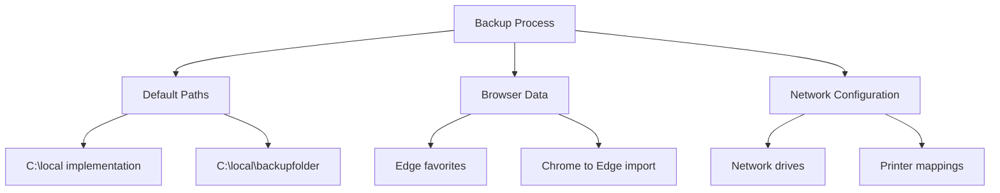
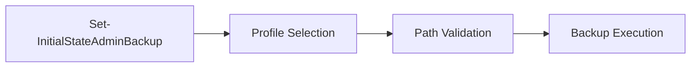
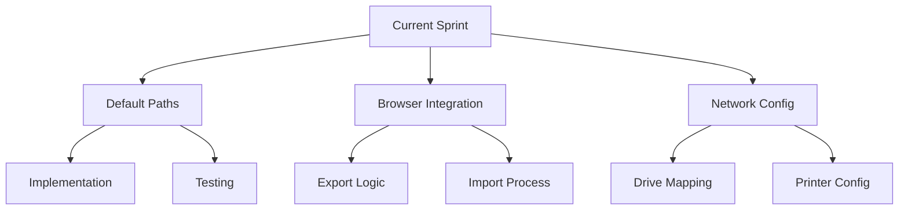
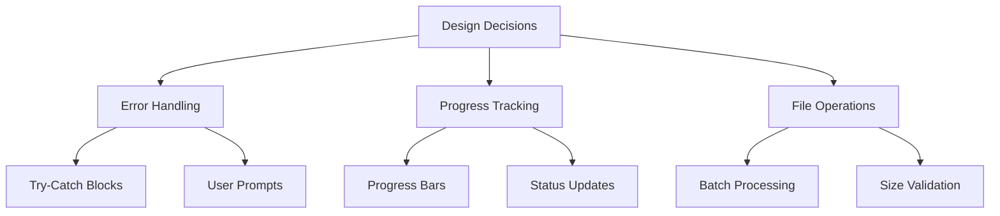

# Active Context

## Current Development Focus

### 1. Backup Process Enhancement

### 2. Active Implementation Tasks
- **Default Path Implementation**
  - Add C:\local for backup operations
  - Implement C:\local\backupfolder for restore
  - Validate path existence and permissions

- **Browser Integration**
  - Edge favorites export mechanism
  - Chrome favorites backup
  - Chrome to Edge import process
  - Browser profile handling

- **System Configuration**
  - Network drive capture improvements
  - Printer mapping enhancements
  - Quick access links backup
  - Sticky notes data handling

### 3. Core Function Updates

## Recent Changes

### 1. Code Implementation
- Added GPUpdate functionality
- Implemented configuration manager actions
- Enhanced user certificate handling
- Added NVIDIA service management

### 2. Architecture Updates
- Separated backup/restore logic
- Enhanced progress tracking
- Improved error handling
- Added validation checks

### 3. Documentation
- Updated function documentation
- Added error code references
- Enhanced user guidance
- Improved setup instructions

## Next Steps

### 1. Immediate Tasks

### 2. Planned Features
- OneNote mapped books backup
- Enhanced PST file handling
- Improved signature timestamp comparison
- Additional validation checks

### 3. Technical Debt
- Refactor file copy operations
- Enhance error recovery
- Optimize large file handling
- Improve progress reporting

## Active Decisions

### 1. Implementation Choices
- Using filesystem COM objects for size calculations
- Implementing robust error handling
- Adding detailed progress tracking
- Enhancing user feedback

### 2. Technical Approaches

### 3. Open Questions
- Optimal PST file handling strategy
- Browser profile management approach
- Network timeout handling
- Cross-version compatibility

## Development Guidelines

### 1. Code Standards
- Clear function documentation
- Consistent error handling
- Progress reporting
- User feedback

### 2. Testing Requirements
- Path validation
- Permission checks
- Network operations
- Error scenarios

### 3. Documentation Updates
- Function descriptions
- Parameter details
- Error codes
- User instructions

## Current Challenges

### 1. Technical Issues
- Large file handling
- Network timeouts
- Permission management
- Cross-machine compatibility

### 2. Implementation Concerns
- Browser data consistency
- Configuration persistence
- Error recovery
- Progress accuracy

### 3. Future Considerations
- Scalability improvements
- Performance optimization
- Enhanced error handling
- Additional backup items

## Project Status

### 1. Completed Items
- Basic backup/restore functionality
- GUI implementation
- Progress tracking
- Error handling

### 2. In Progress
- Default path implementation
- Browser data handling
- Network configuration
- System settings

### 3. Upcoming Work
- OneNote integration
- PST file management
- Additional validations
- Enhanced recovery
