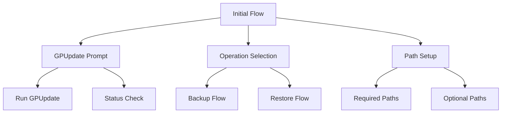
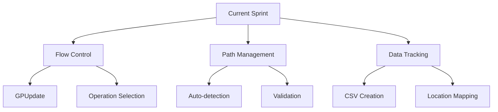
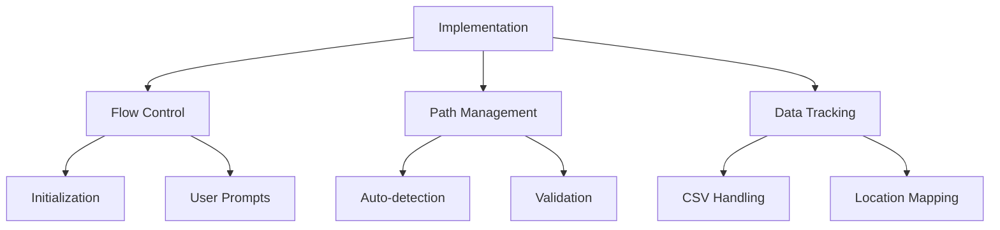

# Active Context

## Current Development Focus

### 1. Initial Flow Enhancement

### 2. Active Implementation Tasks
- **Initial Flow Implementation**
  - Add GPUpdate prompt at start
  - Implement Backup/Restore selection
  - Set up required and optional paths
  - Add CSV file management

- **Path Management**
  - Required paths configuration
  - Optional paths setup
  - Path existence validation
  - Permission checks

- **Data Tracking**
  - FileList CSV creation
  - Original location tracking
  - Path mapping for restore
  - Data validation and verification

### 3. Core Function Updates

## Recent Changes

### 1. Code Implementation
- Identified need for GPUpdate prompt
- Found missing path auto-detection
- Discovered CSV tracking requirements
- Located flow control improvements

### 2. Architecture Updates
- Planned flow reorganization
- Enhanced path management
- Improved CSV handling
- Added validation checks

### 3. Documentation
- Updated progress tracking
- Enhanced implementation status
- Added new requirements
- Documented flow changes

## Next Steps

### 1. Immediate Tasks

### 2. Planned Features
- Enhanced flow control
- Automatic path detection
- CSV file management
- Improved restore mapping

### 3. Technical Debt
- Refactor initialization logic
- Enhance path validation
- Optimize CSV handling
- Improve flow control

## Active Decisions

### 1. Implementation Choices
- Move GPUpdate prompt to start
- Add operation selection dialog
- Implement automatic path scanning
- Add CSV file management

### 2. Technical Approaches

### 3. Open Questions
- Path detection reliability
- CSV file format
- Flow control structure
- Error handling approach

## Development Guidelines

### 1. Code Standards
- Clear flow control
- Consistent path handling
- CSV file management
- User interaction

### 2. Testing Requirements
- Flow validation
- Path detection
- CSV handling
- Error scenarios

### 3. Documentation Updates
- Flow description
- Path configuration
- CSV format
- User instructions

## Current Challenges

### 1. Technical Issues
- Path detection accuracy
- CSV file management
- Flow control reliability
- Cross-version compatibility

### 2. Implementation Concerns
- Initial flow clarity
- Path validation
- Data persistence
- Error recovery

### 3. Future Considerations
- Enhanced path detection
- Improved CSV handling
- Better flow control
- Additional validation

## Project Status

### 1. Completed Items
- Basic GUI implementation
- Initial backup/restore
- Progress tracking
- Error handling

### 2. In Progress
- Flow enhancement
- Path management
- CSV handling
- Data tracking

### 3. Upcoming Work
- Enhanced path detection
- Improved CSV management
- Better flow control
- Additional validation
