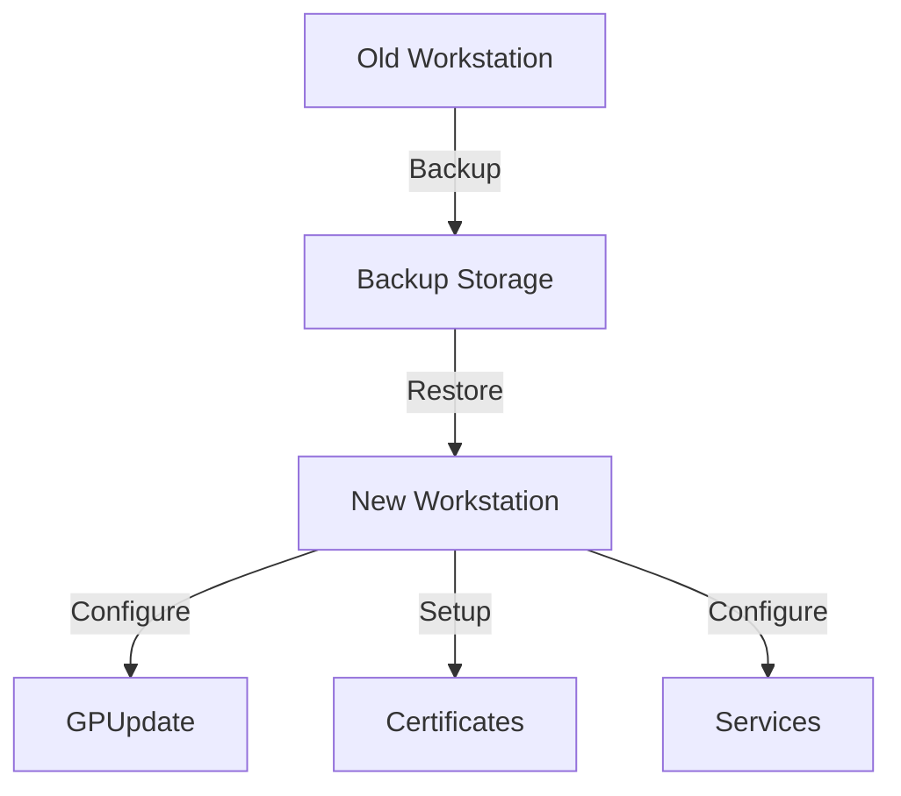
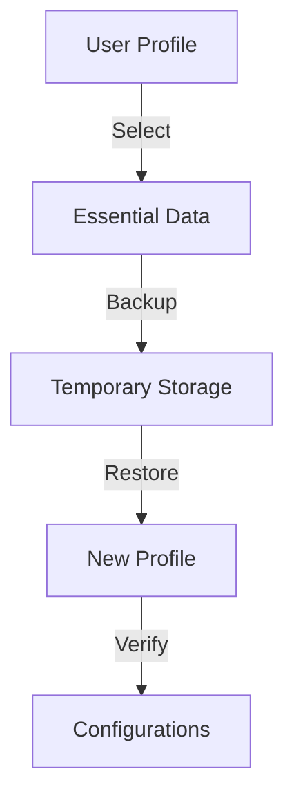
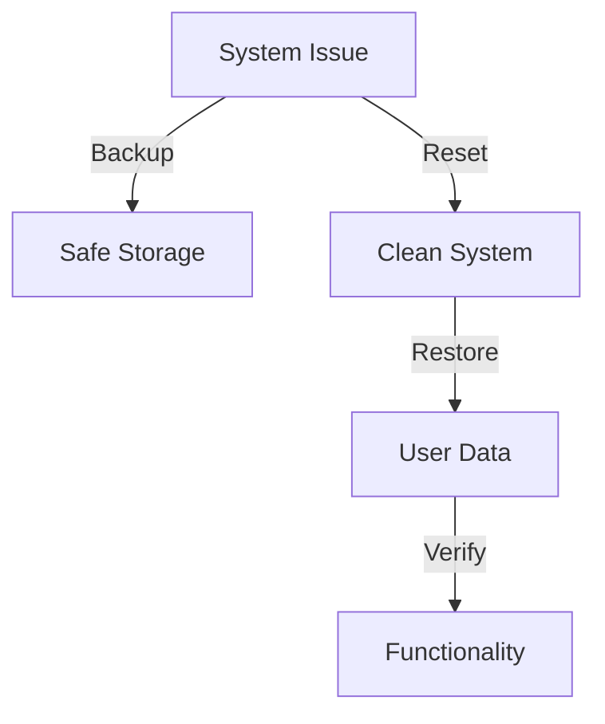

# Product Context

## Purpose
The PowerShell User Data Backup/Restore Utility serves as a comprehensive solution for IT administrators to efficiently manage user data migration and backup processes. It provides a unified interface for backing up and restoring user profile data, settings, and configurations across Windows systems.

## Problems Solved

### 1. Data Migration Complexity
- Eliminates manual copying of user files and settings
- Standardizes the backup/restore process
- Reduces human error in data transfer
- Handles complex file paths and permissions automatically

### 2. Configuration Persistence
- Preserves network drive mappings
- Maintains printer configurations
- Retains browser favorites and settings
- Captures application-specific data (Outlook, OneNote, Sticky Notes)

### 3. Cross-Machine Migration
- Supports transfer between different Windows machines
- Manages user profile compatibility
- Handles system-specific configurations
- Automates post-restore configuration

### 4. IT Administration Efficiency
- Reduces time spent on manual data transfers
- Standardizes the migration process
- Provides clear progress tracking
- Includes error handling and recovery

## User Experience Goals

### 1. Intuitive Interface
- XAML-based GUI for easy interaction
- Clear progress indicators
- Logical workflow organization
- Informative error messages

### 2. Process Visibility
```
User Flow:
1. Select Backup/Restore mode
2. Choose source/destination locations
3. Select items to backup/restore
4. Monitor progress with visual feedback
5. Receive completion confirmation
```

### 3. Flexible Operation
- Custom file/folder selection
- Optional network/printer configuration backup
- Configurable destination paths
- Admin and standard user modes

### 4. Error Management
- Clear error messages
- Recovery options
- Operation logging
- Validation checks

## Usage Scenarios

### 1. Workstation Refresh


### 2. Profile Migration


### 3. System Recovery


## Critical Success Factors

### 1. Data Integrity
- Complete data transfer
- File permission preservation
- Configuration accuracy
- Validation checks

### 2. User Experience
- Minimal user intervention
- Clear progress indication
- Intuitive interface
- Helpful error messages

### 3. Performance
- Efficient file copying
- Progress feedback
- Error recovery
- System resource management

### 4. Reliability
- Consistent operation
- Error handling
- Recovery options
- Logging and tracking
