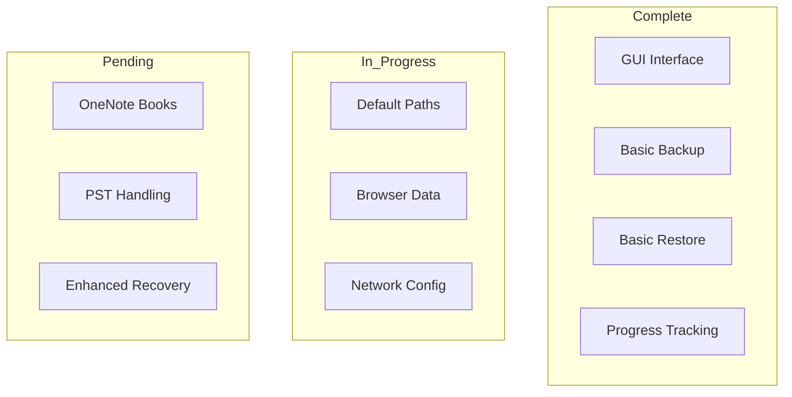
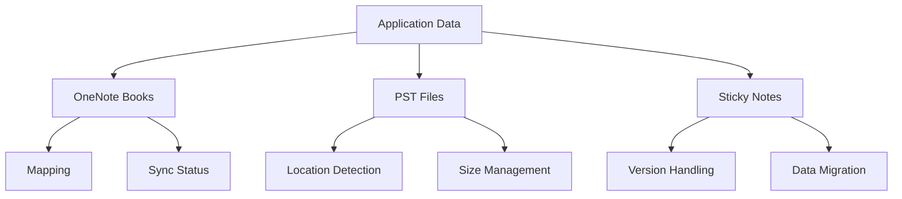
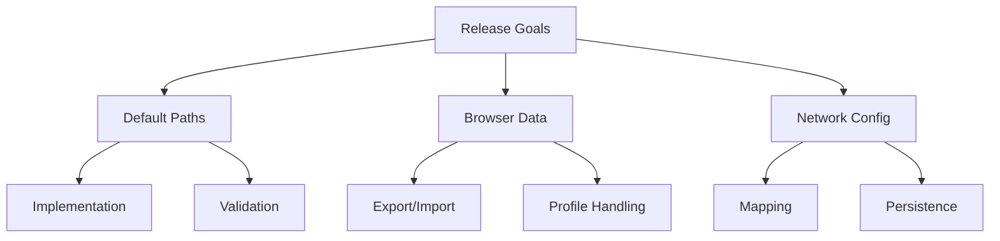

# Progress Status

## Implementation Status

### 1. Core Features

## Working Features

### 1. User Interface
- ✅ XAML-based GUI
- ✅ Progress bars
- ✅ User prompts
- ✅ File/folder selection

### 2. Backup Operations
- ✅ User profile backup
- ✅ Custom location backup
- ✅ File copying with progress
- ✅ Error handling and recovery

### 3. Restore Operations
- ✅ Profile restoration
- ✅ Location selection
- ✅ Progress tracking
- ✅ Error management

### 4. System Integration
- ✅ Registry operations
- ✅ Network drive handling
- ✅ Printer configuration
- ✅ GPUpdate functionality

## In Progress

### 1. Default Paths
- 🔄 C:\local implementation
- 🔄 C:\local\backupfolder setup
- 🔄 Path validation
- 🔄 Permission handling

### 2. Browser Integration
- 🔄 Edge favorites export
- 🔄 Chrome favorites backup
- 🔄 Chrome to Edge import
- 🔄 Profile management

### 3. Network Configuration
- 🔄 Drive mapping improvements
- 🔄 Printer setup enhancements
- 🔄 Quick access backup
- 🔄 Network timeout handling

## Pending Features

### 1. Application Data

### 2. System Configuration
- ⏳ Enhanced certificate management
- ⏳ Service configuration improvements
- ⏳ Additional validation checks
- ⏳ Recovery point creation

### 3. Performance Enhancements
- ⏳ Large file optimization
- ⏳ Network transfer improvements
- ⏳ Progress calculation accuracy
- ⏳ Memory usage optimization

## Known Issues

### 1. Technical Limitations
- 🐛 PST file size constraints
- 🐛 Network timeout handling
- 🐛 Cross-version compatibility
- 🐛 Permission edge cases

### 2. User Experience
- 🐛 Progress accuracy for large files
- 🐛 Network status feedback
- 🐛 Error message clarity
- 🐛 Recovery options display

### 3. Implementation Gaps
- 🐛 Browser profile handling
- 🐛 OneNote sync status
- 🐛 Service state persistence
- 🐛 Network retry logic

## Next Release Target

### 1. Priority Features

### 2. Critical Fixes
- 🎯 PST file handling
- 🎯 Network resilience
- 🎯 Progress accuracy
- 🎯 Error recovery

### 3. Documentation
- 🎯 User guide updates
- 🎯 Admin documentation
- 🎯 Error reference
- 🎯 Recovery procedures

## Testing Status

### 1. Completed Tests
- ✅ Basic backup/restore
- ✅ GUI functionality
- ✅ Progress tracking
- ✅ Error handling

### 2. In Progress
- 🔄 Default path validation
- 🔄 Browser data migration
- 🔄 Network configuration
- 🔄 Large file handling

### 3. Planned Tests
- ⏳ Cross-machine migration
- ⏳ Network resilience
- ⏳ Recovery scenarios
- ⏳ Performance metrics

## Success Metrics

### 1. Performance
- 📊 File transfer speed
- 📊 Memory usage
- 📊 Network efficiency
- 📊 UI responsiveness

### 2. Reliability
- 📊 Error recovery rate
- 📊 Data integrity
- 📊 Network resilience
- 📊 Configuration persistence

### 3. User Experience
- 📊 Task completion rate
- 📊 Error clarity
- 📊 Progress accuracy
- 📊 Recovery success
