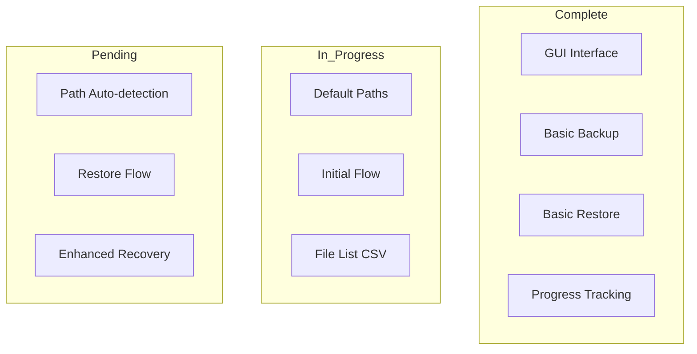
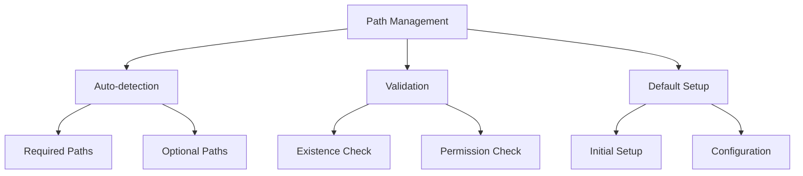
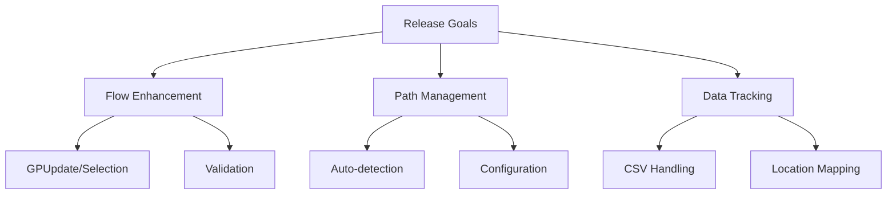

# Progress Status

## Implementation Status

### 1. Core Features

## Working Features

### 1. User Interface
- ✅ XAML-based GUI
- ✅ Progress bars
- ✅ User prompts
- ✅ File/folder selection
- ✅ Space calculations

### 2. Backup Operations
- ✅ User profile backup
- ✅ Custom location backup
- ✅ File copying with progress
- ✅ Error handling and recovery

### 3. Restore Operations
- ✅ Profile restoration
- ✅ Location selection
- ✅ Progress tracking
- ✅ Error management

### 4. System Integration
- ✅ Registry operations
- ✅ Network drive handling
- ✅ Printer configuration
- ✅ GPUpdate functionality

## In Progress

### 1. Default Paths Enhancement
- 🔄 Required paths implementation
- 🔄 Optional paths setup
- 🔄 Path validation
- 🔄 Automatic path detection

### 2. Flow Improvements
- 🔄 Initial GPUpdate prompt
- 🔄 Backup/Restore selection
- 🔄 Path scanning
- 🔄 CSV file generation

### 3. Data Management
- 🔄 FileList CSV creation
- 🔄 Original location tracking
- 🔄 Restore path mapping
- 🔄 Data validation

## Pending Features

### 1. Path Handling

### 2. System Configuration
- ⏳ Enhanced path detection
- ⏳ Default path configuration
- ⏳ Additional validation checks
- ⏳ Recovery point creation

### 3. Performance Enhancements
- ⏳ Path scanning optimization
- ⏳ CSV file handling
- ⏳ Progress calculation accuracy
- ⏳ Memory usage optimization

## Known Issues

### 1. Technical Limitations
- 🐛 Path detection reliability
- 🐛 CSV file handling
- 🐛 Cross-version compatibility
- 🐛 Permission edge cases

### 2. User Experience
- 🐛 Initial flow clarity
- 🐛 Default path feedback
- 🐛 Error message clarity
- 🐛 Recovery options display

## Next Release Target

### 1. Priority Features

### 2. Critical Fixes
- 🎯 Path detection
- 🎯 Flow improvements
- 🎯 Progress accuracy
- 🎯 Error recovery

### 3. Documentation
- 🎯 Flow documentation
- 🎯 Path configuration
- 🎯 Error reference
- 🎯 Recovery procedures

## Success Metrics

### 1. Performance
- 📊 Path scan speed
- 📊 CSV processing
- 📊 Flow efficiency
- 📊 UI responsiveness

### 2. Reliability
- 📊 Path detection accuracy
- 📊 Data integrity
- 📊 Flow consistency
- 📊 Configuration persistence
