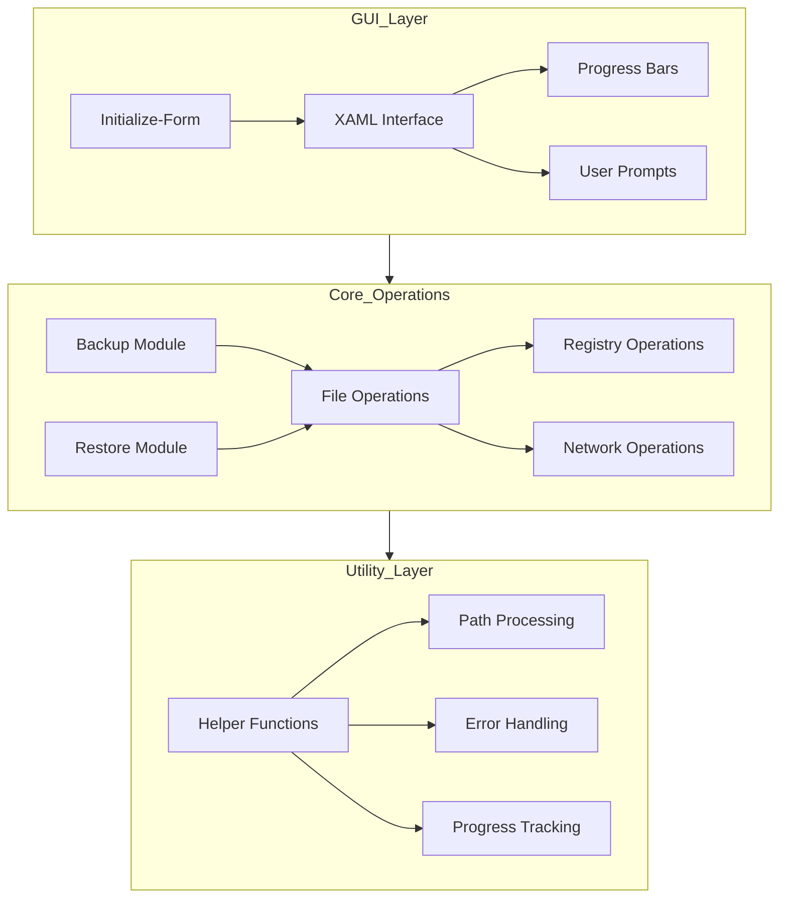
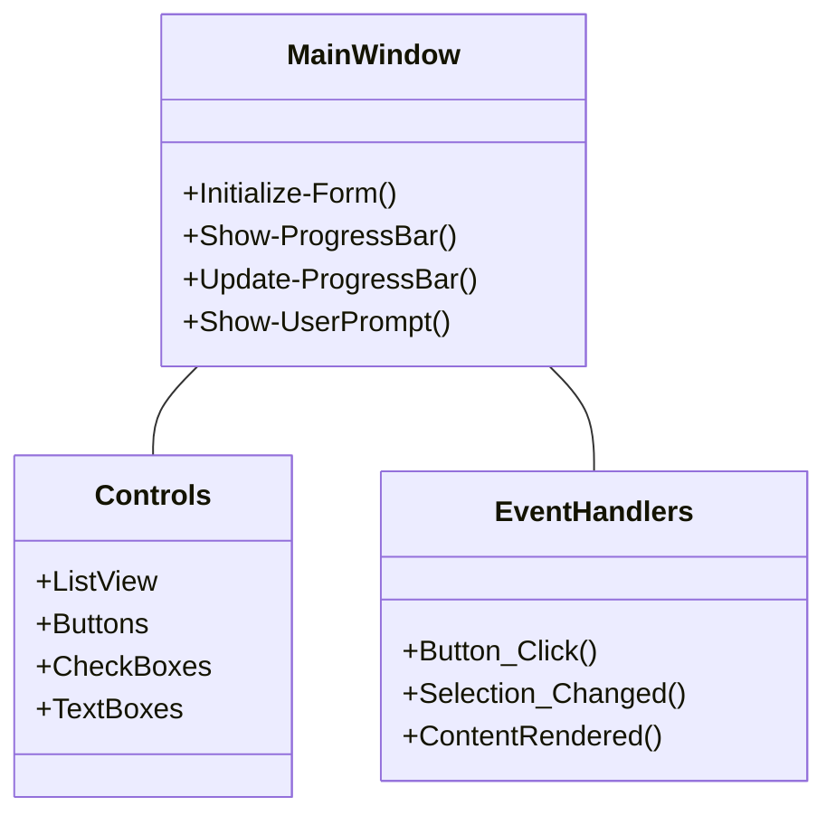
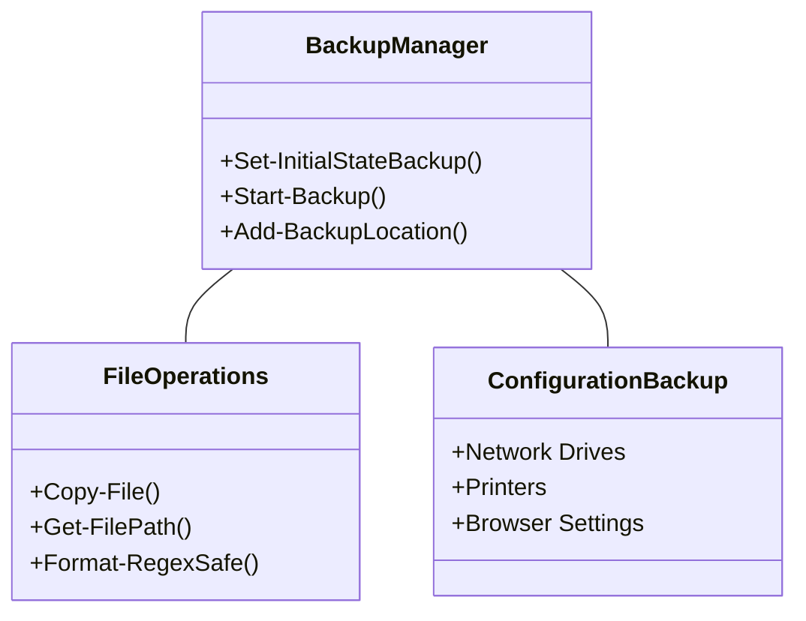
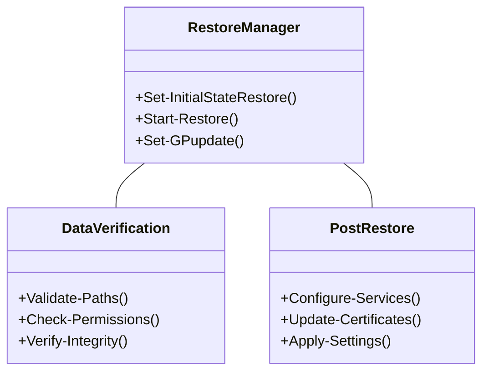
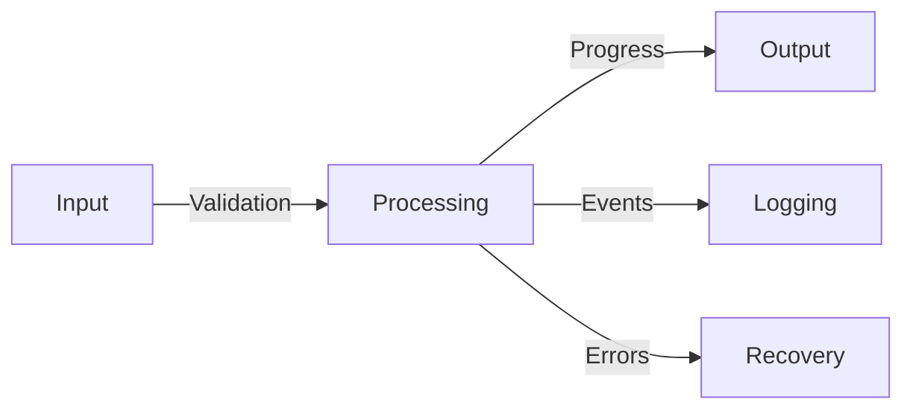
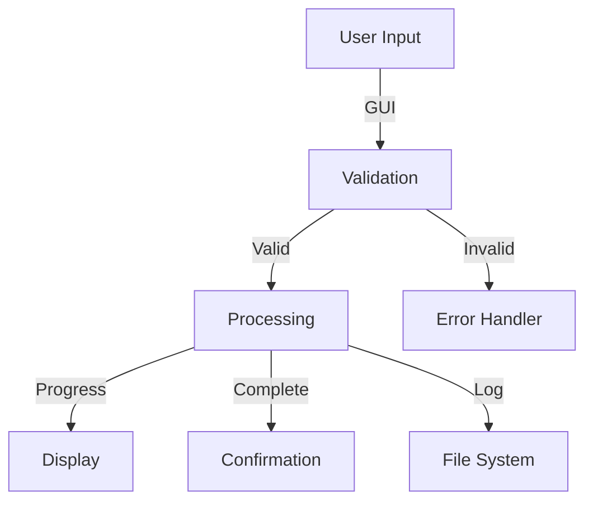
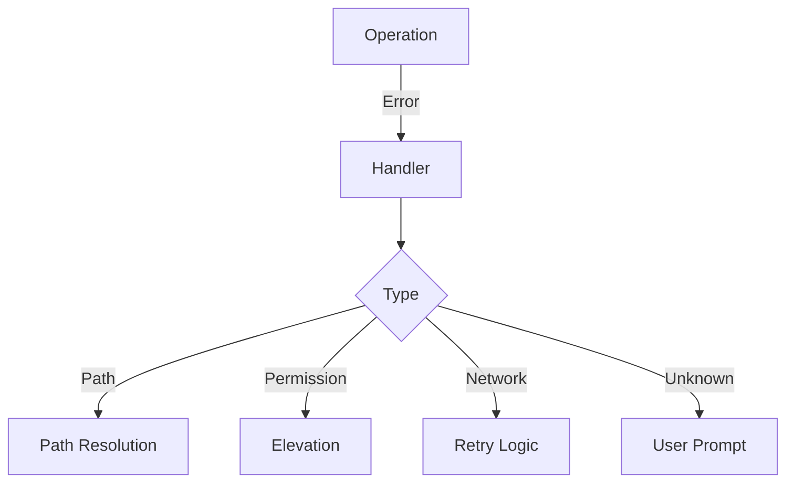

# System Patterns

## Architecture Overview

## Key Components

### 1. GUI Framework

### 2. Backup System

### 3. Restore System

## Design Patterns

### 1. Module Pattern
- Separate functional areas
  - GUI Module
  - Backup Module
  - Restore Module
  - Utility Module
- Clear dependency management
- Encapsulated functionality

### 2. Event-Driven Architecture
- GUI events trigger operations
- Progress updates drive display
- Error events manage recovery
- User prompts handle decisions

### 3. Pipeline Pattern

## Component Relationships

### Data Flow

### Error Handling

## Implementation Guidelines

### 1. Function Structure
- Clear single responsibility
- Parameter validation
- Error handling
- Progress reporting
- Return values

### 2. Error Management
- Try-Catch blocks
- User notifications
- Recovery options
- Logging

### 3. Progress Tracking
- Operation status
- Sub-task progress
- Time estimation
- User feedback

### 4. State Management
- Session persistence
- Configuration tracking
- Operation history
- Recovery points
