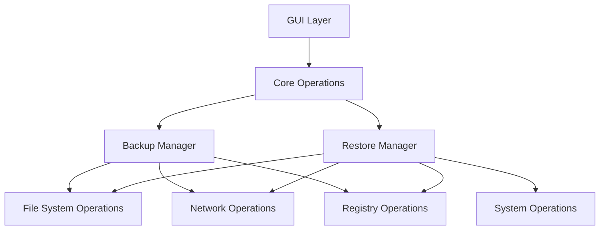
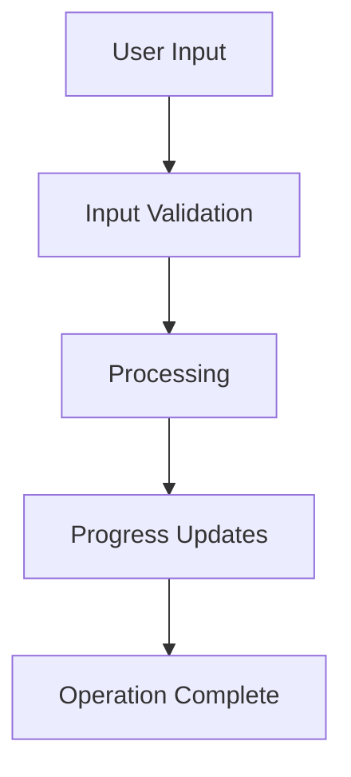

# System Patterns

## Architecture Overview

## Design Patterns

### 1. Module Pattern
- Separate core functionality into distinct PowerShell script blocks
- Clear separation of concerns between backup and restore operations
- Modular approach to file system, network, and registry operations

### 2. Frontend-Backend Separation
- XAML-based GUI layer for user interaction
- Core logic separated from presentation
- Event-driven communication between layers

### 3. State Management
- Initialization states for both backup and restore operations
- Progress tracking through shared state objects
- Error state handling and recovery

### 4. Operation Pipeline

## Component Relationships

### Core Functions
1. **Initialization Components**
   - Set-InitialStateAdminBackup
   - Set-InitialStateBackup
   - Set-InitialStateRestore

2. **Operation Components**
   - Start-Backup
   - Start-Restore
   - Set-GPupdate

3. **UI Components**
   - Initialize-Form
   - Show-ProgressBar
   - Update-ProgressBar
   - Show-UserPrompt

### Data Flow Patterns

## Error Handling Strategy
1. Try-Catch blocks for operation-level errors
2. User feedback through GUI for critical errors
3. Logging for administrative review
4. Recovery procedures for common failure scenarios

## Code Organization
1. Function grouping by operation type
2. Shared utility functions
3. GUI-specific code separation
4. Configuration and constant management
