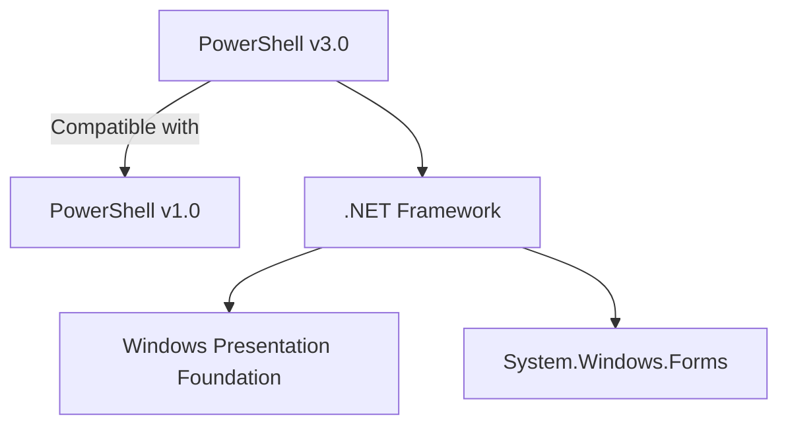
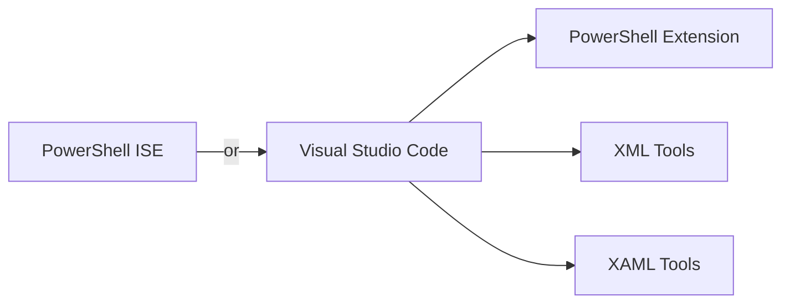
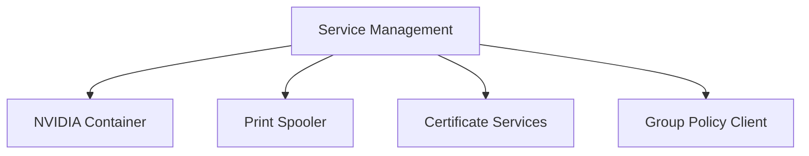
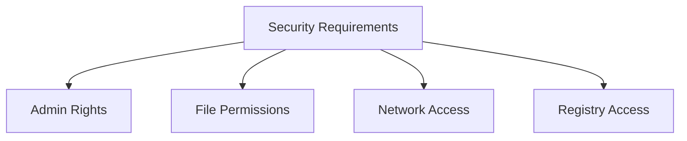
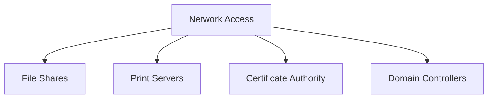

# Technical Context

## Technology Stack

### 1. Core Technologies


### 2. Frameworks and Dependencies
- **PowerShell Requirements**
  - Version: 3.0 (with v1.0 compatibility)
  - Execution Policy: Unrestricted for script execution
  - Administrative privileges for certain operations

- **Required Assemblies**
  ```powershell
  Add-Type -AssemblyName presentationframework  # WPF GUI
  Add-Type -AssemblyName System.Windows.Forms   # File dialogs
  Add-Type -Language CSharp                     # Custom types
  ```

- **Core Libraries**
  - Microsoft.Win32 (Registry operations)
  - System.Xml (XAML parsing)
  - System.Security.Principal (User validation)

### 3. System Requirements
- Windows Operating System (Win7+)
- .NET Framework 4.5+
- Administrative access for full functionality
- Network connectivity for remote operations

## Development Environment

### 1. Required Tools


### 2. Testing Environment
- Local Windows machine for development
- Remote test machines for cross-machine operations
- Various Windows versions for compatibility testing
- Network environment for drive mapping tests

### 3. Development Guidelines
- PowerShell best practices
- WPF/XAML design patterns
- Error handling standards
- Progress reporting requirements

## Integration Points

### 1. File System
- User profile directories
- System directories
- Network shares
- Special folders (AppData, ProgramData)

### 2. Windows Registry
```powershell
# Key Registry Paths
$userProfilePath = "HKEY_USERS\$SID"
$shellFolders = "Software\Microsoft\Windows\CurrentVersion\Explorer\User Shell Folders"
$networkDrives = "Network"
```

### 3. Network Services
- Network drive mapping
- Printer connections
- Certificate services
- Group Policy updates

### 4. System Services


## Technical Constraints

### 1. PowerShell Limitations
- Version compatibility issues
- Execution policy restrictions
- Remote execution requirements
- Script signing requirements

### 2. Security Considerations


### 3. Performance Factors
- Large file handling
- Network bandwidth
- Remote operation latency
- UI responsiveness

## Configuration Management

### 1. File Paths
```powershell
# Default Paths
$defaultPaths = @{
    LocalBackup = "C:\local"
    RestoreFolder = "C:\local\backupfolder"
    UserProfile = "$env:USERPROFILE"
    AppData = "$env:APPDATA"
}
```

### 2. Registry Settings
- User shell folders
- Network drive mappings
- Application settings
- System configurations

### 3. Error Codes and Logging
```powershell
# Error Categories
$errorTypes = @{
    FileSystem = 1000
    Network = 2000
    Registry = 3000
    Permission = 4000
    Service = 5000
}
```

## External Dependencies

### 1. Windows Components
- Configuration Manager Client
- Certificate Services
- Group Policy Client
- Print Services

### 2. Third-Party Applications
- Chrome Browser (favorites)
- Edge Browser (favorites)
- Outlook (signatures)
- OneNote (mapped books)

### 3. Network Requirements


## Deployment Considerations

### 1. Installation Requirements
- Script deployment method
- Required permissions
- Dependency verification
- Configuration validation

### 2. Update Strategy
- Version control
- Backward compatibility
- Migration scripts
- Configuration preservation
